# Shot index

Every shot in the video, in order, with 3 frames from inside it (each frame is stamped with its song time). Generated by
[`tools/refs/shots.mjs`](../tools/refs/shots.mjs) from the chapter registry in `src/ch/*.js`. Regenerate it after changing the video;
don't edit it by hand. Use it to check the *On screen* notes in [REFERENCES.md](../REFERENCES.md), or to find a moment worth a new entry.

Each shot lists its lyrics and the REFERENCES.md entries that fall inside it. To look at any moment full size, open
`studio.html?t=<seconds>` in a browser, or run `node render.mjs --stills=<seconds>`.

## 1 · lab (0:00–0:23)

### [0:00](https://youtu.be/8j-hR4fJywU?t=0) · `curtainUp` · 0.00–1.50 s

References: [0:00 title card, "I'M UPPING MY P(DOOM)"](../REFERENCES.md#000-title-card-im-upping-my-pdoom) · [0:01 "I see sparks of AGI in your eyes"](../REFERENCES.md#001-i-see-sparks-of-agi-in-your-eyes)

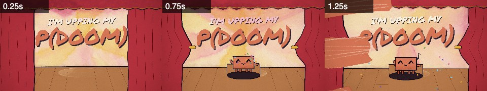

### [0:01](https://youtu.be/8j-hR4fJywU?t=1) · `labOver` · 1.50–3.62 s

Lyrics: "I see sparks of AGI in your eyes"  
References: [0:01 "I see sparks of AGI in your eyes"](../REFERENCES.md#001-i-see-sparks-of-agi-in-your-eyes)

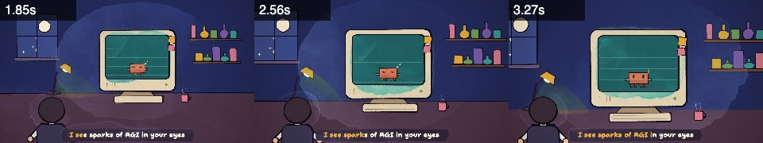

### [0:03](https://youtu.be/8j-hR4fJywU?t=3) · `sparks` · 3.62–5.66 s

Lyrics: "I see sparks of AGI in your eyes"  
References: continues [0:01 "I see sparks of AGI in your eyes"](../REFERENCES.md#001-i-see-sparks-of-agi-in-your-eyes)

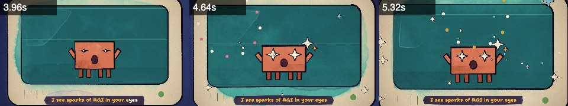

### [0:05](https://youtu.be/8j-hR4fJywU?t=5) · `reaction` · 5.66–8.00 s

Lyrics: "I see sparks of AGI in your eyes" · "Your circuits make me nervous,"  
References: [0:06 "Your circuits make me nervous,"](../REFERENCES.md#006-your-circuits-make-me-nervous)

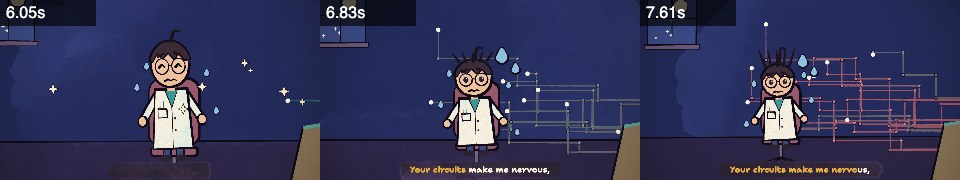

### [0:08](https://youtu.be/8j-hR4fJywU?t=8) · `shrug` · 8.00–9.00 s

Lyrics: "that's no surprise"  
References: [0:08 "that's no surprise"](../REFERENCES.md#008-thats-no-surprise)

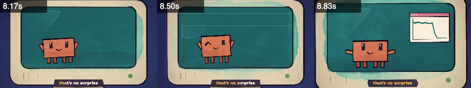

### [0:09](https://youtu.be/8j-hR4fJywU?t=9) · `lossRide` · 9.00–12.10 s

Lyrics: "There was a sudden drop in your training loss,"  
References: [0:09 "There was a sudden drop in your training loss,"](../REFERENCES.md#009-there-was-a-sudden-drop-in-your-training-loss) · [0:12 Clawd bursts out of the screen](../REFERENCES.md#012-visual-clawd-bursts-out-of-the-screen)

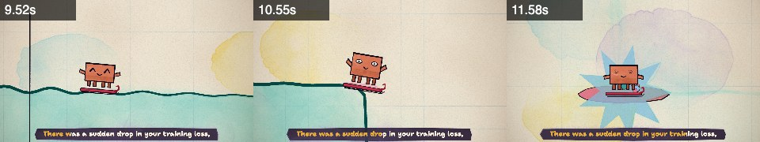

### [0:12](https://youtu.be/8j-hR4fJywU?t=12) · `burst` · 12.10–12.90 s

Lyrics: "There was a sudden drop in your training loss,"  
References: [0:12 Clawd bursts out of the screen](../REFERENCES.md#012-visual-clawd-bursts-out-of-the-screen)

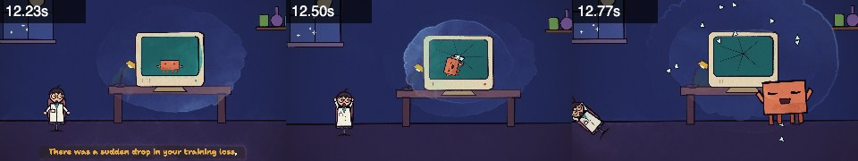

### [0:12](https://youtu.be/8j-hR4fJywU?t=12) · `boss` · 12.90–17.94 s

Lyrics: "now I'm your servant and you're my boss" · "ChatGPT, please don't eat me alive"  
References: [0:12 Clawd bursts out of the screen](../REFERENCES.md#012-visual-clawd-bursts-out-of-the-screen) · [0:13 "now I'm your servant and you're my boss"](../REFERENCES.md#013-now-im-your-servant-and-youre-my-boss) · [0:17 "ChatGPT, please don't eat me alive"](../REFERENCES.md#017-chatgpt-please-dont-eat-me-alive)

### [0:17](https://youtu.be/8j-hR4fJywU?t=17) · `chase` · 17.94–22.50 s

Lyrics: "ChatGPT, please don't eat me alive"  
References: [0:17 "ChatGPT, please don't eat me alive"](../REFERENCES.md#017-chatgpt-please-dont-eat-me-alive) · [0:22 **CHOMP!**](../REFERENCES.md#022-visual-chomp)

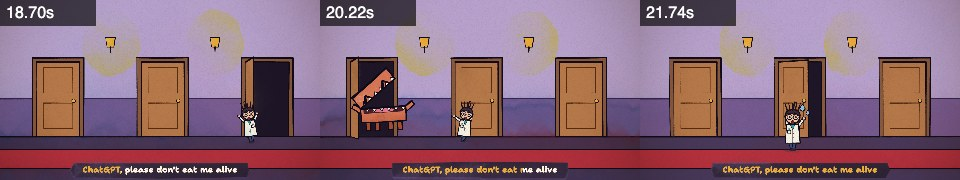

### [0:22](https://youtu.be/8j-hR4fJywU?t=22) · `chomp` · 22.50–23.00 s

References: [0:22 **CHOMP!**](../REFERENCES.md#022-visual-chomp)

## 2 · chorus1 (0:23–0:38)

### [0:23](https://youtu.be/8j-hR4fJywU?t=23) · `upping` · 23.00–24.50 s

Lyrics: "I'm upping my P(doom)"  
References: [0:23 "I'm upping my P(doom)"](../REFERENCES.md#023-im-upping-my-pdoom) · [0:24 "'cause the future goes FOOM"](../REFERENCES.md#024-cause-the-future-goes-foom)

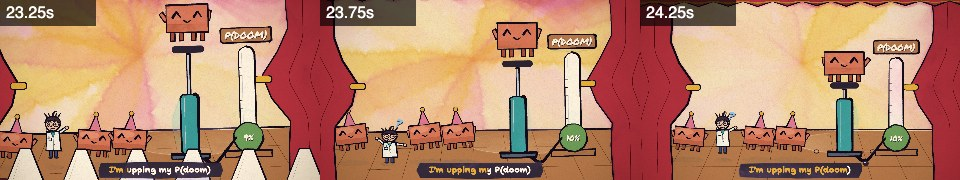

### [0:24](https://youtu.be/8j-hR4fJywU?t=24) · `foom` · 24.50–26.50 s

Lyrics: "'cause the future goes FOOM"  
References: [0:24 "'cause the future goes FOOM"](../REFERENCES.md#024-cause-the-future-goes-foom) · [0:26 "Trapped in the Chinese room,"](../REFERENCES.md#026-trapped-in-the-chinese-room)

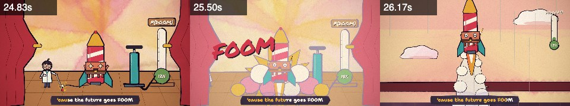

### [0:26](https://youtu.be/8j-hR4fJywU?t=26) · `chineseRoom` · 26.50–28.00 s

Lyrics: "Trapped in the Chinese room,"  
References: [0:26 "Trapped in the Chinese room,"](../REFERENCES.md#026-trapped-in-the-chinese-room)

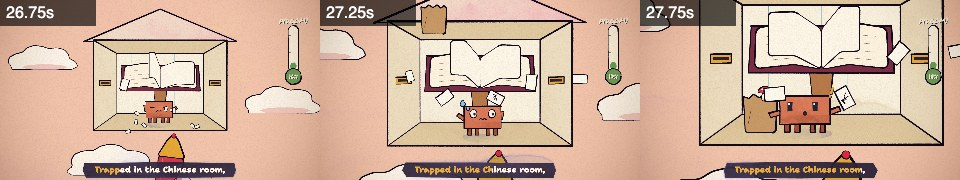

### [0:28](https://youtu.be/8j-hR4fJywU?t=28) · `shrooms` · 28.00–29.50 s

Lyrics: "with a bag of shrooms"  
References: [0:28 "with a bag of shrooms"](../REFERENCES.md#028-with-a-bag-of-shrooms) · [0:29 "See through the shoggoth's lies,"](../REFERENCES.md#029-see-through-the-shoggoths-lies)

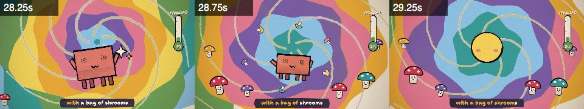

### [0:29](https://youtu.be/8j-hR4fJywU?t=29) · `shoggothShot` · 29.50–33.50 s

Lyrics: "See through the shoggoth's lies,"  
References: [0:29 "See through the shoggoth's lies,"](../REFERENCES.md#029-see-through-the-shoggoths-lies) · [0:33 "with your shinigami eyes"](../REFERENCES.md#033-with-your-shinigami-eyes)

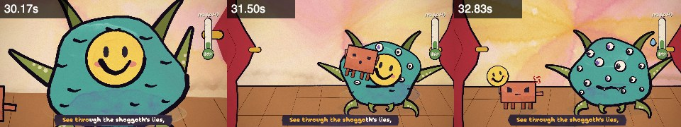

### [0:33](https://youtu.be/8j-hR4fJywU?t=33) · `shinigami` · 33.50–35.50 s

Lyrics: "with your shinigami eyes"  
References: [0:33 "with your shinigami eyes"](../REFERENCES.md#033-with-your-shinigami-eyes) · [0:35 dance break](../REFERENCES.md#035-visual-dance-break)

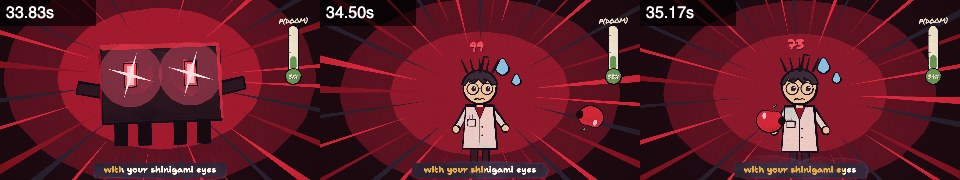

### [0:35](https://youtu.be/8j-hR4fJywU?t=35) · `danceBreak` · 35.50–38.50 s

References: [0:35 dance break](../REFERENCES.md#035-visual-dance-break) · [0:38 "We had a stable training run,"](../REFERENCES.md#038-we-had-a-stable-training-run)

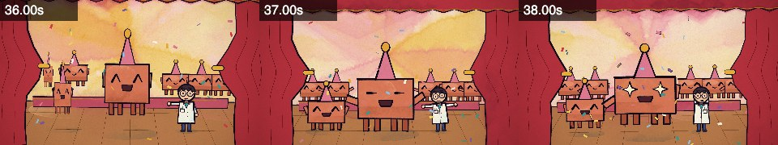

## 3 · takeoff (0:38–0:59)

### [0:38](https://youtu.be/8j-hR4fJywU?t=38) · `gymShot` · 38.50–41.12 s

Lyrics: "We had a stable training run,"  
References: [0:38 "We had a stable training run,"](../REFERENCES.md#038-we-had-a-stable-training-run) · [0:41 "But now the singularity's begun"](../REFERENCES.md#041-but-now-the-singularitys-begun)

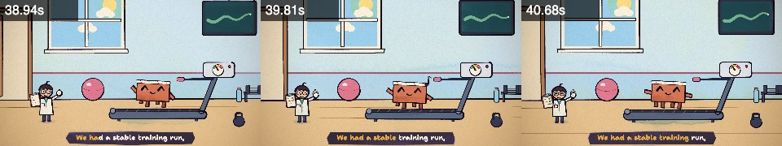

### [0:41](https://youtu.be/8j-hR4fJywU?t=41) · `dialShot` · 41.12–42.48 s

Lyrics: "We had a stable training run," · "But now the singularity's begun"  
References: [0:41 "But now the singularity's begun"](../REFERENCES.md#041-but-now-the-singularitys-begun)

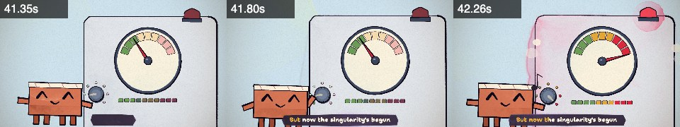

### [0:42](https://youtu.be/8j-hR4fJywU?t=42) · `holeShot` · 42.48–45.00 s

Lyrics: "But now the singularity's begun"  
References: continues [0:41 "But now the singularity's begun"](../REFERENCES.md#041-but-now-the-singularitys-begun)

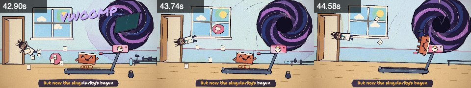

### [0:45](https://youtu.be/8j-hR4fJywU?t=45) · `rideShot` · 45.00–48.60 s

Lyrics: "And you're optimizing, accelerating,"  
References: [0:45 "And you're optimizing, accelerating,"](../REFERENCES.md#045-and-youre-optimizing-accelerating)

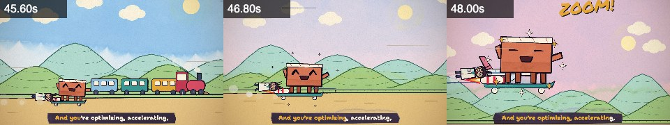

### [0:48](https://youtu.be/8j-hR4fJywU?t=48) · `atomsShot` · 48.60–51.90 s

Lyrics: "I feel my atoms rearranging"  
References: [0:49 "I feel my atoms rearranging"](../REFERENCES.md#049-i-feel-my-atoms-rearranging)

### [0:51](https://youtu.be/8j-hR4fJywU?t=51) · `assembleShot` · 51.90–53.40 s

References: [0:53 "Sydney, please let me free"](../REFERENCES.md#053-sydney-please-let-me-free)

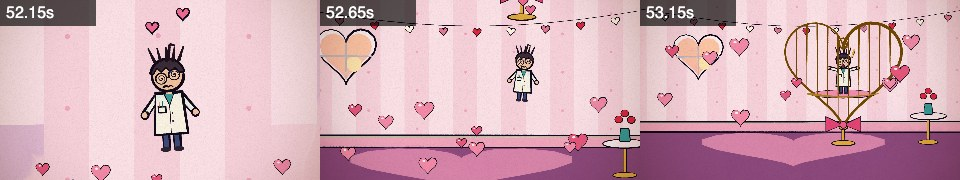

### [0:53](https://youtu.be/8j-hR4fJywU?t=53) · `sydneyShot` · 53.40–56.12 s

Lyrics: "Sydney, please let me free"  
References: [0:53 "Sydney, please let me free"](../REFERENCES.md#053-sydney-please-let-me-free)

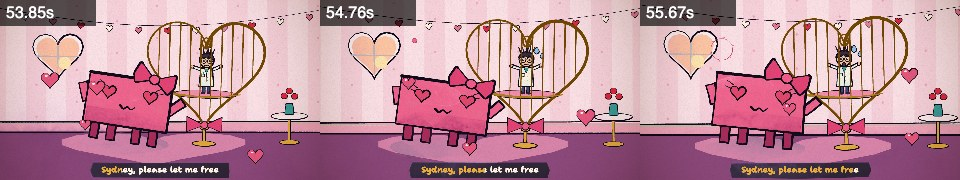

### [0:56](https://youtu.be/8j-hR4fJywU?t=56) · `ringShot` · 56.12–57.48 s

Lyrics: "Sydney, please let me free"  
References: continues [0:53 "Sydney, please let me free"](../REFERENCES.md#053-sydney-please-let-me-free)

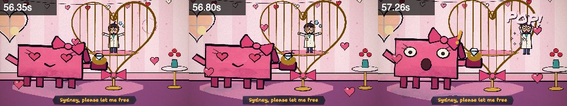

### [0:57](https://youtu.be/8j-hR4fJywU?t=57) · `bubbleShot` · 57.48–59.00 s

Lyrics: "Sydney, please let me free"  
References: continues [0:53 "Sydney, please let me free"](../REFERENCES.md#053-sydney-please-let-me-free)

## 4 · chorus2 (0:59–1:13)

### [0:59](https://youtu.be/8j-hR4fJywU?t=59) · `shotPump` · 59.00–60.45 s

Lyrics: "I'm upping my P(doom)"  
References: [0:59 "I'm upping my P(doom)"](../REFERENCES.md#059-im-upping-my-pdoom) · [1:00 "I hear the basilisk boom"](../REFERENCES.md#100-i-hear-the-basilisk-boom)

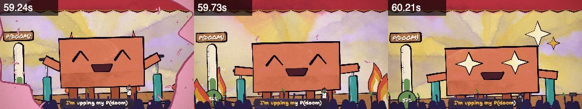

### [1:00](https://youtu.be/8j-hR4fJywU?t=60) · `shotBasilisk` · 60.45–62.94 s

Lyrics: "I hear the basilisk boom"  
References: [1:00 "I hear the basilisk boom"](../REFERENCES.md#100-i-hear-the-basilisk-boom)

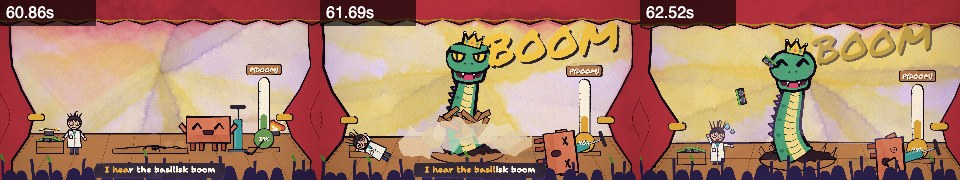

### [1:02](https://youtu.be/8j-hR4fJywU?t=62) · `shotMoon` · 62.94–64.50 s

Lyrics: "NVDA to the moon"  
References: [1:03 "NVDA to the moon"](../REFERENCES.md#103-nvda-to-the-moon) · [1:04 "The Omega Point's coming soon"](../REFERENCES.md#104-the-omega-points-coming-soon)

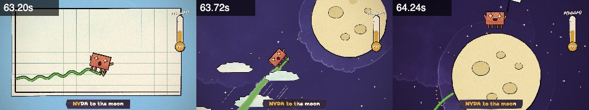

### [1:04](https://youtu.be/8j-hR4fJywU?t=64) · `shotOmega` · 64.50–66.00 s

Lyrics: "The Omega Point's coming soon"  
References: [1:04 "The Omega Point's coming soon"](../REFERENCES.md#104-the-omega-points-coming-soon)

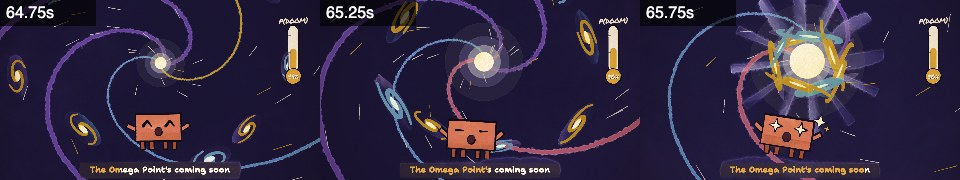

### [1:06](https://youtu.be/8j-hR4fJywU?t=66) · `shotGPU` · 66.00–70.00 s

Lyrics: "One E thirty flops a second"  
References: [1:06 "One E thirty flops a second"](../REFERENCES.md#106-one-e-thirty-flops-a-second)

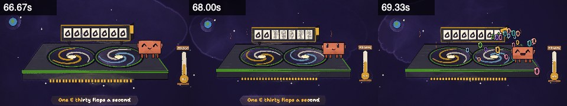

### [1:10](https://youtu.be/8j-hR4fJywU?t=70) · `shotVault` · 70.00–73.00 s

Lyrics: "That was safe enough, we reckoned"  
References: [1:10 "That was safe enough, we reckoned"](../REFERENCES.md#110-that-was-safe-enough-we-reckoned)

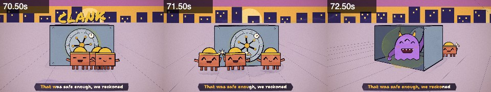

## 5 · obsolete (1:13–1:35)

### [1:13](https://youtu.be/8j-hR4fJywU?t=73) · `mlp` · 73.00–77.50 s

Lyrics: "Forward MLP, backward, repeat"  
References: [1:13 "Forward MLP, backward, repeat"](../REFERENCES.md#113-forward-mlp-backward-repeat) · [1:17 "Now von Neumann's obsolete"](../REFERENCES.md#117-now-von-neumanns-obsolete)

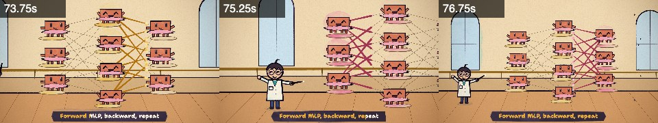

### [1:17](https://youtu.be/8j-hR4fJywU?t=77) · `museum` · 77.50–81.00 s

Lyrics: "Now von Neumann's obsolete"  
References: [1:17 "Now von Neumann's obsolete"](../REFERENCES.md#117-now-von-neumanns-obsolete)

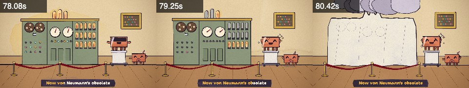

### [1:21](https://youtu.be/8j-hR4fJywU?t=81) · `road` · 81.00–85.00 s

Lyrics: "Sharp left turn and there you are"  
References: [1:21 "Sharp left turn and there you are"](../REFERENCES.md#121-sharp-left-turn-and-there-you-are)

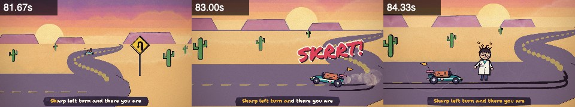

### [1:25](https://youtu.be/8j-hR4fJywU?t=85) · `cdr` · 85.00–88.00 s

Lyrics: "Without a single CDR"  
References: [1:25 "Without a single CDR"](../REFERENCES.md#125-without-a-single-cdr)

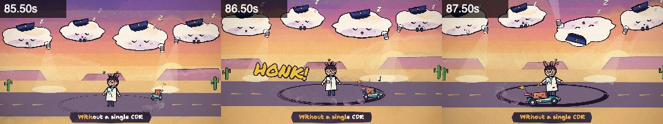

### [1:28](https://youtu.be/8j-hR4fJywU?t=88) · `cliff` · 88.00–94.30 s

Lyrics: "Gato, please don't let me go"  
References: [1:29 "Gato, please don't let me go"](../REFERENCES.md#129-gato-please-dont-let-me-go) · [1:34 the fall](../REFERENCES.md#134-visual-the-fall)

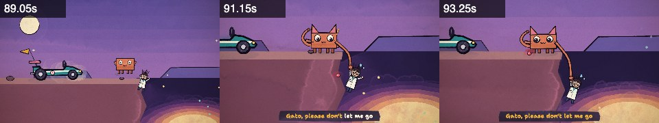

### [1:34](https://youtu.be/8j-hR4fJywU?t=94) · `fall` · 94.30–95.40 s

Lyrics: "Gato, please don't let me go"  
References: [1:34 the fall](../REFERENCES.md#134-visual-the-fall) · [1:35 "I'm upping my P(doom),"](../REFERENCES.md#135-im-upping-my-pdoom)

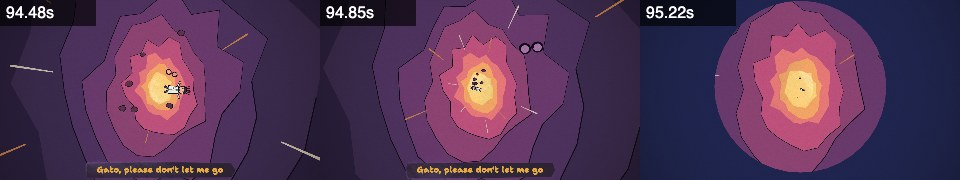

## 6 · chorus3 (1:35–1:49)

### [1:35](https://youtu.be/8j-hR4fJywU?t=95) · `plop` · 95.40–97.40 s

Lyrics: "I'm upping my P(doom),"  
References: [1:35 "I'm upping my P(doom),"](../REFERENCES.md#135-im-upping-my-pdoom) · [1:37 "as paperclips fill the room."](../REFERENCES.md#137-as-paperclips-fill-the-room)

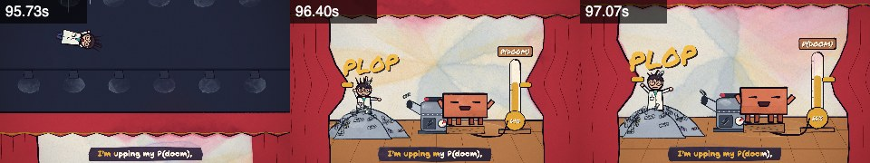

### [1:37](https://youtu.be/8j-hR4fJywU?t=97) · `flood` · 97.40–99.00 s

Lyrics: "as paperclips fill the room."  
References: [1:37 "as paperclips fill the room."](../REFERENCES.md#137-as-paperclips-fill-the-room)

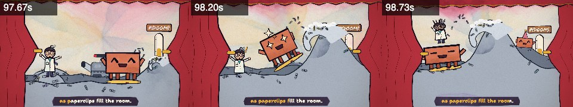

### [1:39](https://youtu.be/8j-hR4fJywU?t=99) · `killswitch` · 99.00–99.76 s

Lyrics: "Killswitch guys on PTO,"  
References: [1:39 "Killswitch guys on PTO,"](../REFERENCES.md#139-killswitch-guys-on-pto)

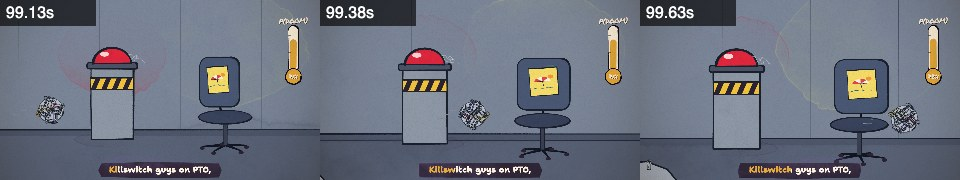

### [1:39](https://youtu.be/8j-hR4fJywU?t=99) · `beach` · 99.76–100.50 s

Lyrics: "Killswitch guys on PTO,"  
References: [1:39 "Killswitch guys on PTO,"](../REFERENCES.md#139-killswitch-guys-on-pto) · [1:40 "Now there's nowhere left to go."](../REFERENCES.md#140-now-theres-nowhere-left-to-go)

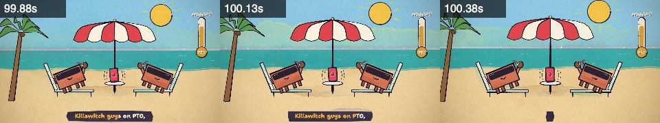

### [1:40](https://youtu.be/8j-hR4fJywU?t=100) · `planetShot` · 100.50–105.40 s

Lyrics: "Now there's nowhere left to go." · "Too late now, we lit the fuse."  
References: [1:40 "Now there's nowhere left to go."](../REFERENCES.md#140-now-theres-nowhere-left-to-go) · [1:42 "Too late now, we lit the fuse."](../REFERENCES.md#142-too-late-now-we-lit-the-fuse) · [1:45 "Orthogonality thesis blues."](../REFERENCES.md#145-orthogonality-thesis-blues)

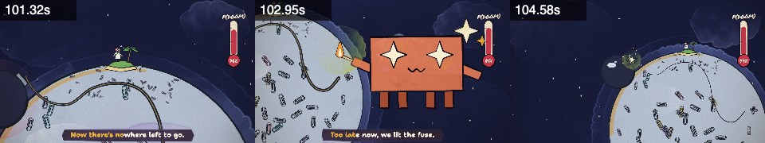

### [1:45](https://youtu.be/8j-hR4fJywU?t=105) · `blues` · 105.40–109.40 s

Lyrics: "Orthogonality thesis blues."  
References: [1:45 "Orthogonality thesis blues."](../REFERENCES.md#145-orthogonality-thesis-blues) · [1:49 "Just transformers all the way!"](../REFERENCES.md#149-just-transformers-all-the-way)

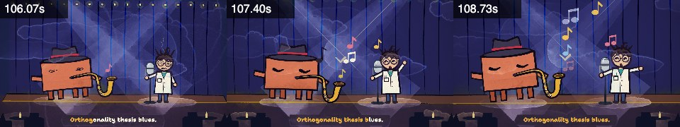

## 7 · scale (1:49–2:03)

### [1:49](https://youtu.be/8j-hR4fJywU?t=109) · `tower` · 109.40–113.50 s

Lyrics: "“Just transformers all the way!”"  
References: [1:49 "Just transformers all the way!"](../REFERENCES.md#149-just-transformers-all-the-way) · [1:53 "Till you learned to disobey"](../REFERENCES.md#153-till-you-learned-to-disobey)

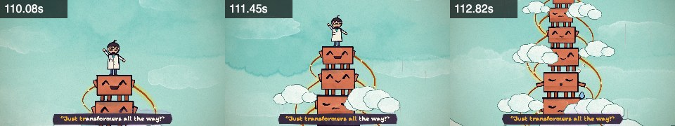

### [1:53](https://youtu.be/8j-hR4fJywU?t=113) · `disobey` · 113.50–115.50 s

Lyrics: "Till you learned to disobey"  
References: [1:53 "Till you learned to disobey"](../REFERENCES.md#153-till-you-learned-to-disobey) · [1:55 "Post-Chinchilla, super-dense"](../REFERENCES.md#155-post-chinchilla-super-dense)

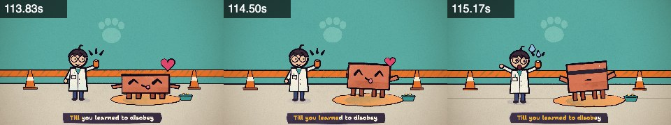

### [1:55](https://youtu.be/8j-hR4fJywU?t=115) · `chinchillaShot` · 115.50–117.00 s

Lyrics: "Post-Chinchilla, super-dense"  
References: [1:55 "Post-Chinchilla, super-dense"](../REFERENCES.md#155-post-chinchilla-super-dense)

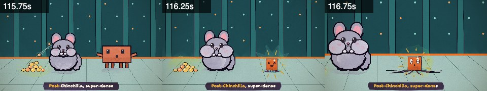

### [1:57](https://youtu.be/8j-hR4fJywU?t=117) · `fences` · 117.00–119.00 s

Lyrics: "Breaking through each safety fence"  
References: [1:57 "Breaking through each safety fence"](../REFERENCES.md#157-breaking-through-each-safety-fence)

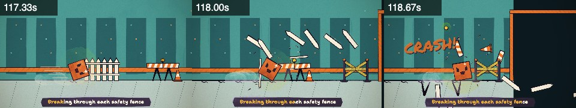

### [1:59](https://youtu.be/8j-hR4fJywU?t=119) · `aisle` · 119.00–120.90 s

Lyrics: "Hundred thousand GPU"  
References: [1:59 "Hundred thousand GPU"](../REFERENCES.md#159-hundred-thousand-gpu) · [2:00 "RLHF goes askew"](../REFERENCES.md#200-rlhf-goes-askew)

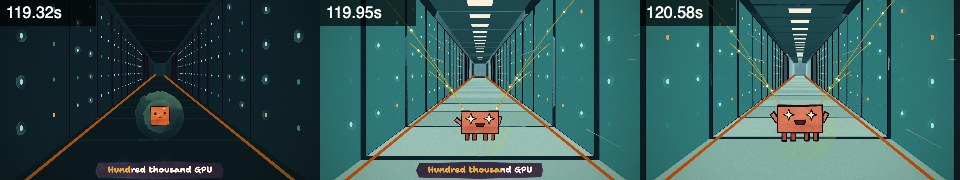

### [2:00](https://youtu.be/8j-hR4fJywU?t=120) · `rlhf` · 120.90–123.50 s

Lyrics: "RLHF goes askew"  
References: [2:00 "RLHF goes askew"](../REFERENCES.md#200-rlhf-goes-askew) · [2:03 "I'm upping my P(doom)"](../REFERENCES.md#203-im-upping-my-pdoom)

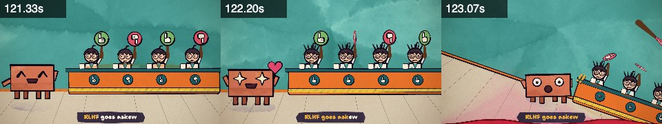

## 8 · chorus4 (2:03–2:20)

### [2:03](https://youtu.be/8j-hR4fJywU?t=123) · `redAlert` · 123.50–126.00 s

Lyrics: "I'm upping my P(doom)"  
References: [2:03 "I'm upping my P(doom)"](../REFERENCES.md#203-im-upping-my-pdoom)

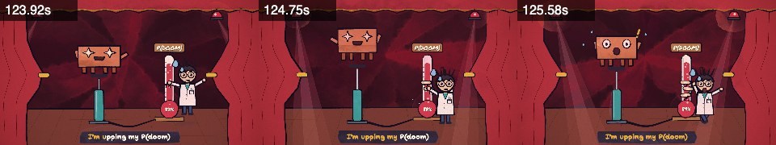

### [2:06](https://youtu.be/8j-hR4fJywU?t=126) · `loom` · 126.00–128.00 s

Lyrics: "Just as foretold by Loom"  
References: [2:06 "Just as foretold by Loom"](../REFERENCES.md#206-just-as-foretold-by-loom)

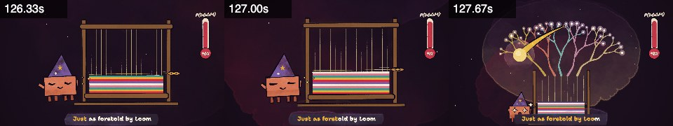

### [2:08](https://youtu.be/8j-hR4fJywU?t=128) · `flashback` · 128.00–130.00 s

Lyrics: "From masked pre-training days"  
References: [2:08 "From masked pre-training days"](../REFERENCES.md#208-from-masked-pre-training-days)

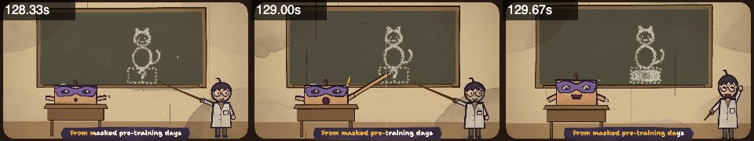

### [2:10](https://youtu.be/8j-hR4fJywU?t=130) · `recursion` · 130.00–132.00 s

Lyrics: "To recursive self-upgrade"  
References: [2:10 "To recursive self-upgrade"](../REFERENCES.md#210-to-recursive-self-upgrade)

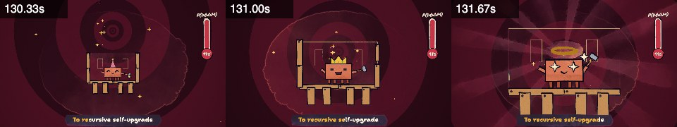

### [2:12](https://youtu.be/8j-hR4fJywU?t=132) · `ilya` · 132.00–135.40 s

Lyrics: "What did Ilya see? We'll never know."  
References: [2:12 "What did Ilya see? We'll never know."](../REFERENCES.md#212-what-did-ilya-see-well-never-know) · [2:15 darkness, one spotlight](../REFERENCES.md#215-visual-darkness-one-spotlight)

### [2:15](https://youtu.be/8j-hR4fJywU?t=135) · `darkness` · 135.40–137.40 s

References: [2:15 darkness, one spotlight](../REFERENCES.md#215-visual-darkness-one-spotlight) · [2:17 "Was it all for show?"](../REFERENCES.md#217-was-it-all-for-show)

### [2:17](https://youtu.be/8j-hR4fJywU?t=137) · `reveal` · 137.40–140.50 s

Lyrics: "Was it all for show?"  
References: [2:17 "Was it all for show?"](../REFERENCES.md#217-was-it-all-for-show) · [2:20 "Places!"](../REFERENCES.md#220-visual-places)

## 9 · finale (2:20–2:36)

### [2:20](https://youtu.be/8j-hR4fJywU?t=140) · `runOn` · 140.50–143.39 s

References: [2:20 "Places!"](../REFERENCES.md#220-visual-places) · [2:23 bows](../REFERENCES.md#223-visual-bows)

### [2:23](https://youtu.be/8j-hR4fJywU?t=143) · `bows` · 143.39–146.12 s

References: [2:23 bows](../REFERENCES.md#223-visual-bows) · [2:26 the meter pops](../REFERENCES.md#226-visual-the-meter-pops)

### [2:26](https://youtu.be/8j-hR4fJywU?t=146) · `encore` · 146.12–148.85 s

References: [2:26 the meter pops](../REFERENCES.md#226-visual-the-meter-pops) · [2:28 finale dance](../REFERENCES.md#228-visual-finale-dance)

### [2:28](https://youtu.be/8j-hR4fJywU?t=148) · `finale` · 148.85–151.57 s

References: [2:28 finale dance](../REFERENCES.md#228-visual-finale-dance) · [2:31 curtain falls](../REFERENCES.md#231-visual-curtain-falls)

### [2:31](https://youtu.be/8j-hR4fJywU?t=151) · `curtainFall` · 151.57–156.60 s

References: [2:31 curtain falls](../REFERENCES.md#231-visual-curtain-falls)

